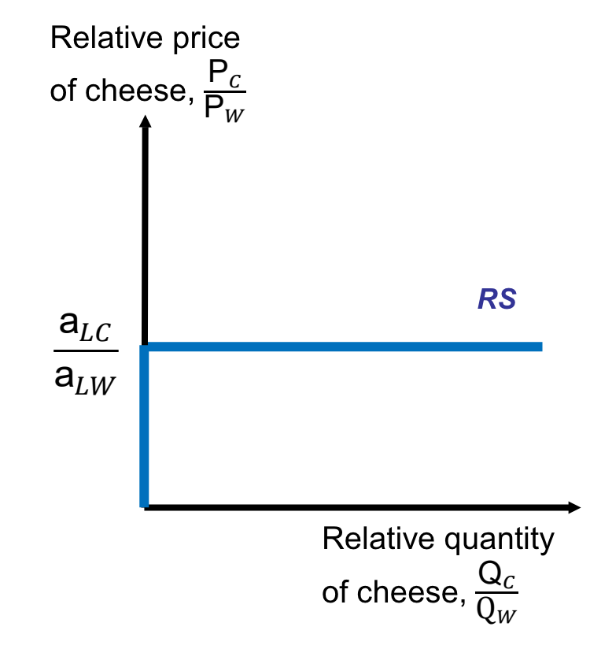

# Week 1: Comparative Advantage and the Ricardian Model

## Concepts Definition:

- **Marginal product of labour (MPL)**: the amount of output produced by an additional worker.

- **Absolute Advantage**: A country has an absolute advantage in a sector if it can produce a greater
output of that sector using the same amount of resources

- **Opportunity Cost**: The opportunity cost of an unit of cheese is the amount of wine that could be
produced using the same resources.

- **Comparative Advantage**: A country has a comparative advantage in producing a good if it has a lower opportunity cost of producing that good than other countries.

## Autarky:

Consider the following assumptions:
- 2 goods: Cheese and Wine.
- 1 factor: Labour.
- The labour productivity is fixed and labour is mobile across industries.

The **production functions** of cheese and wine can be expressed as: 
- Q~c~ = $\frac{L~c~}{a~Lc~}$
- Q~w~ = $\frac{L~w~}{a~Lw~}$

where a~Lc~ and a~Lw~ indicates the amount of labour needed to produce one unit of wine/cheese. 

**Labour endowment** can be expressed as:
- L~w~ + L~c~ = L

**Production Possibility Set**:
- a~Lc~Q~c~ + a~Lw~Q~w~ <= L

**Production Possibility Frontier**:
- a~Lc~Q~c~ + a~Lw~Q~w~ = L

- slope~PPF~ = - (L/a~Lw~)/(L/a~Lc~) = -a~Lc~/a~Lw~

- OC~cheese~ = a~Lc~/a~Lw~, OC~wine~ = a~Lw~/a~Lc~

**Industry Equilibrium**:

Under perfect competition, firms maximise profit at $P = MC$, thus:
- P~c~ = a~Lc~wage~c~ => wage~c~ = P~c~/a~Lc~
- P~w~ = a~Lw~wage~cw~ => wage~w~ = P~w~/a~Lw~

If a country produces both goods with labour mobile across both sectors, in equilibrium, 
-  wage~w~ = wage~c = w, 
- P~c~/a~Lc~ = P~w~/a~Lw~, so
- **P~c~/P~w~ = a~Lc~/a~Lw~**, meaning that ==the relative price of cheese is equivalent to the opportunity cost of cheese.==

**Production Choice**
- If  **P~c~/P~w~ > a~Lc~/a~Lw~**, producers will specialise in producing cheese, thus Q~c~ = L/a~Lc~ and Q~w~ = 0.
- If **P~c~/P~w~ < a~Lc~/a~Lw~**, producers will specialise in producing wine, thus thus Q~w~ = L/a~Lw~ and Q~c~ = 0.
- If **P~c~/P~w~ = a~Lc~/a~Lw~** (wage~c~ = wage~w~), the autarky will produce both cheese and wine. Output levels are undetermined but will lie on the PPF.

**Relative Supply Function**
- If P~c~/P~w~ < a~Lc~/a~Lw~, Q~c~/Q~w~ = 0 and Q~c~ = 0.
- If P~c~/P~w~ = a~Lc~/a~Lw~, Q~c~/Q~w~ > 0 and 0 < Q~c~ < a~Lc~.
- If If P~c~/P~w~ > a~Lc~/a~Lw~, Q~c~/Q~w~ = &infin; and Q~c~ = L/a~Lc~.

**Consumer Choice**

The consumer takes prices and income as given and chooses consumptions, D~c~ and D~w~, to maximize a utility function U(D~c~, D~w~) expressing preferences.

- Income: 
$I = P_cD_c + P_wD_w$

- Demand: 
We assume that relative demand is a decreasing function of relative prices, like $\frac{D_c}{D_w}$= $2/\frac{P_c}{P_w}$.

**Autarky Equilibrium**

Autarky equilibrium price ratio: 
$P_c/P_w = OC_c = a_{Lc}/a_{Lw}$, when consumers always demand both goods and both goods are produced accordingly.

## Trade with Foriegn

**Assumptions**: 

Foreign: 
- $a_{Lw} = 2$ and $a_{Lc} = 3$.
- $L = L_w + L_c = 120$

Home:
- $a_{Lw} = 2$ and $a_{Lc} = 1$.
- $L = L_w + L_c = 120$

$OC_c (home)= a_{Lc}/{a_{Lw}} = 1/2$

$OC_c (foreign) = {a_{Lc}}/{a_{Lw}} = 3/2$

**Principle of comparative advantage**

Each country should export goods that it produces at a cheaper relative price/oppotunity cost in autarky. 

In our example, home has a comparative advantage in cheese production and foreign has a comparative advantage in wine production. Therefore, home should export cheese in exchange for wine.

**World Relative Demand and Supply**

$RS_{world} = \frac{Q_c(home) + Q_c(foreign)}{Q_w(home) + Q_w(foreign)}$ 

Relative supply of cheese is dependent on the relative price of cheese: 

- If $\frac{P_c}{P_w} = \frac{a_{Lc}}{a_{Lw}}(home)$, home is indifferent about producing cheese or wine so it will produce both. While foreign will produce wine. 

- If $\frac{a_{Lc}}{a_{Lw}}(home) < \frac{P_c}{P_w} < \frac{a_{Lc}}{a_{Lw}}(foreign)$, home will produce cheese only and foreign will produce wine only. 

- If $\frac{P_c}{P_w} >= \frac{a_{Lc}}{a_{Lw}}(foreign)$, home will produce cheese only and foreign will produce both cheese and wine. Because given the current relative price, foreign will be indifferent about producing both. 

The relative supply and demand of cheese and wine will show on the world production possibility frontier as follows:

## Gains from Trade

1. **Trade expands consumption possibilities**:

Take Home country for example: 

If home produces wine, it can produce $\frac{1}{a_{Lw}}$ units of wine per hour. 

If home produces cheese and trades for wine, it can obtain 
$\frac{1}{a_{Lw}}\frac{P_c}{P_w}$ units of wine per hour. 

Since home has a comparative advantage in producing cheese, $\frac{1}{a_{Lw}}\frac{P_c}{P_w} > \frac{1}{a_{Lw}}$, thus trade enlarges the consumption possibility.

***Exception: when one country is very large (has very high demand)***: 

In the below example, foreign is a very large economy and has a very high relative demand of cheese. 

As the result, the relative price of cheese is so high that trading with home makes no difference in relative prices in foreign. 

Home will specialise in cheese, while foreign will continue to produce both goods. In this case, home gains a lot from trade while foreign gains very little. 

**2. Wages and Trade**:

Assume that ==home specialise in cheese and foreign specialises in wine==: 

Wages are: $w_{home} = \frac{1}{a_{Lc}}P_c$, $w_{foreign} = \frac{1}{a_{Lw}}P_w$

Relative wages are: $\frac{w_{home}}{w_{foreign}} = \frac{a_{Lw}}{a_{Lc}} * \frac{P_c}{P_w}$. 

When productivity improves (i.e: $a_{Lc}$ decreases), home's workers will get a higher real wage. 

When price of cheese rises, home's workers will get a higher real wage. 

Assume that ==home is large, so home produces both cheese and wine while foreign specialises in wine==: 

Wages are: $w_{home} = \frac{1}{a_{Lc}}P_c = \frac{1}{a_{Lw}}P_w$ and $w_{foreign} = \frac{1}{a_{Lw}}P_w$

Absolute advantage in wine (produced by both countries) determines the relative wage between Home and Foreign countries.

