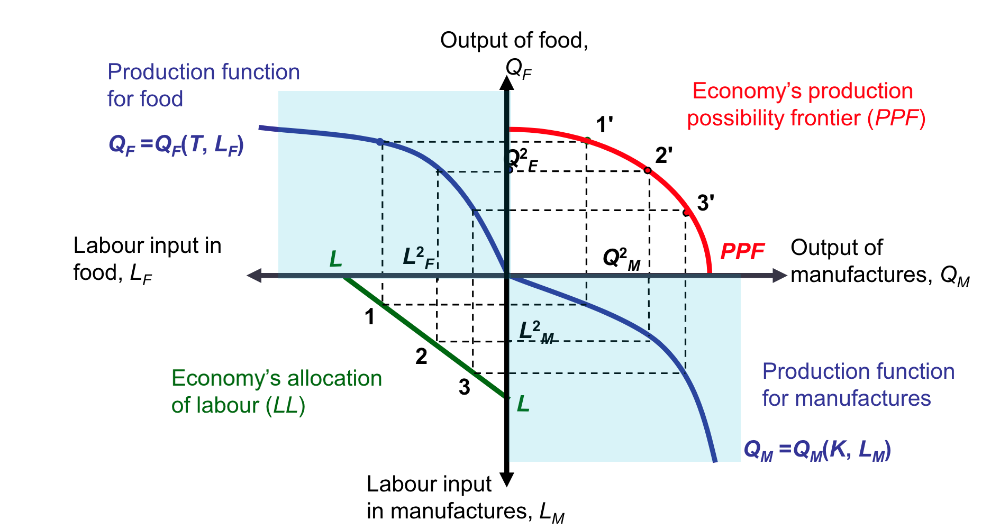
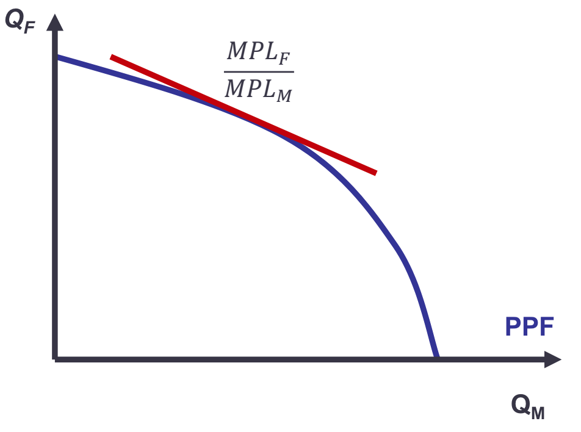
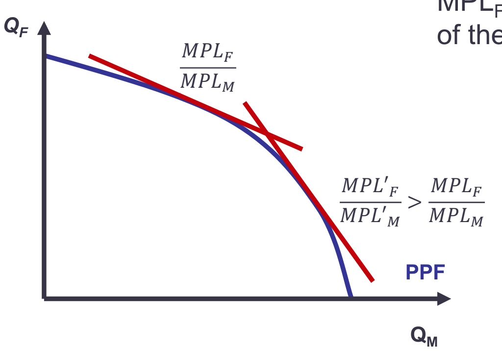

# Week 2: Specific Factors Model

## Intuition
Trade has substantial effects on the income distribution within each trading nation, because: 
- In the short run, some factors are mobile across industries, while others are immobile. 
- Industries differ in the factors of production they demand.

## Assumptions and Technology:

- Two goods: Manufatures (M) and Food(F)

- Three factors of production: : labour (L), capital (K) and land (T)

- <mark> Manufacturing sector employs $K$ and $L_M$ Food sector employs $T$ and $L_F$.

    - **Production Functions:**

        $Q_M = F(K, L_M)$ where $Q_M$ is the output for manufatures, $K$ is the economy's capital stock and $L_M$ is the labour used to produce manufacturing.

        $Q_F = F(T, L_F)$ where $Q_F$ is the output for manufatures, $T$ is the economy's land stock and $L_F$ is the labour used to produce food.

        

        **Marginal product of labour** in manufacturing: $MPL_M = \frac{\delta{Q_M}}{\delta{L_M}} > 0$.

        The shape of the product function reflects another assumption of the specific factors model: **diminishing returns to labour**. 
        
        Intuition behind this is that adding one additional worker to the production process means that each worker now has less capital to work with. 

- <mark> Labour is a mobile factor across sectors: 
    - $L_M + L_F = L$, meaning that  the economywide supply of labour must equal the labour employed in food plus the labour employed in manufactures. 

    - **Production possibility Frontier**:

    

    - **Marginal Rate of Transformation**: 

        As labour moves between Food sector and Manufacturing sector, output in both sectors change: 

        $\delta Q_M = MPL_{M} * \delta L_M$

        $\delta Q_F = MPL_{F} * \delta L_F$

        

        Since $\delta L_M = - \delta L_F$, $Slope_{PPF} = \frac{\delta Q_M}{\delta Q_F} = - \frac{MPL_{M}}{MPL_{M}}$. 
        
        <mark> Marginal rate of transformation is thus given by $\frac{MPL_{M}}{MPL_{M}}$.

        **When labour shifts from the food sector to the manufacture sector, $MPL_{M}$ falls while $MPL_{F}$ rise**. Because each manufacturing worker now has less capital to work with while each worker remaining in the food sector now has more land to work with. 

        

- L is exogenous, but $L_M$ and $L_F$ are endogenous

- Perfect competition prevails in all markets.

